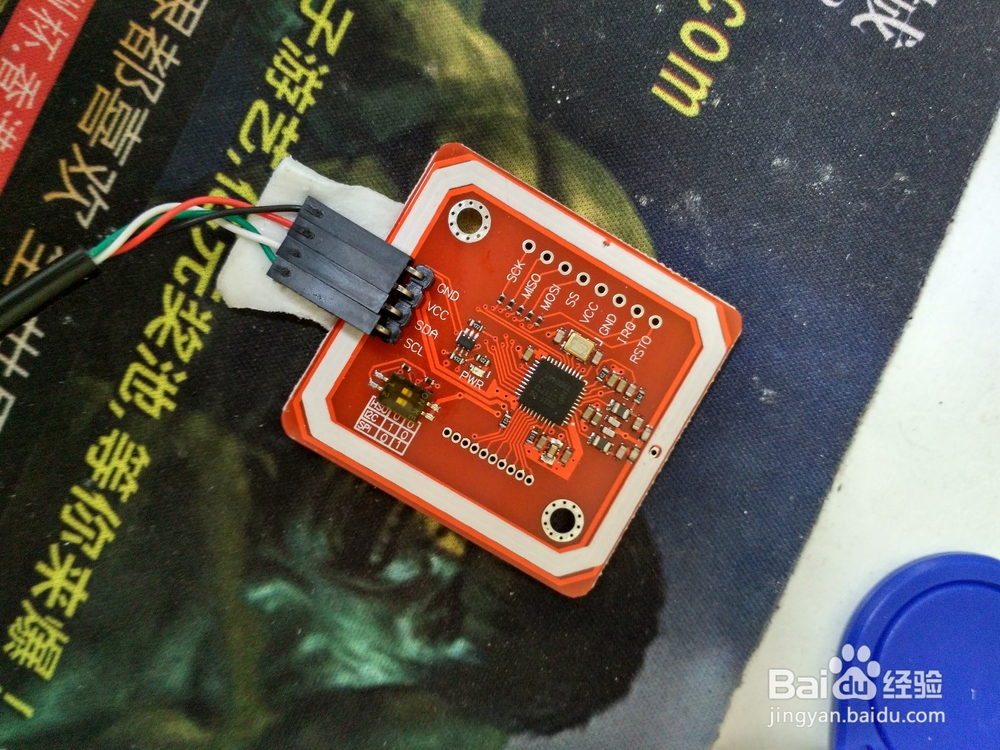
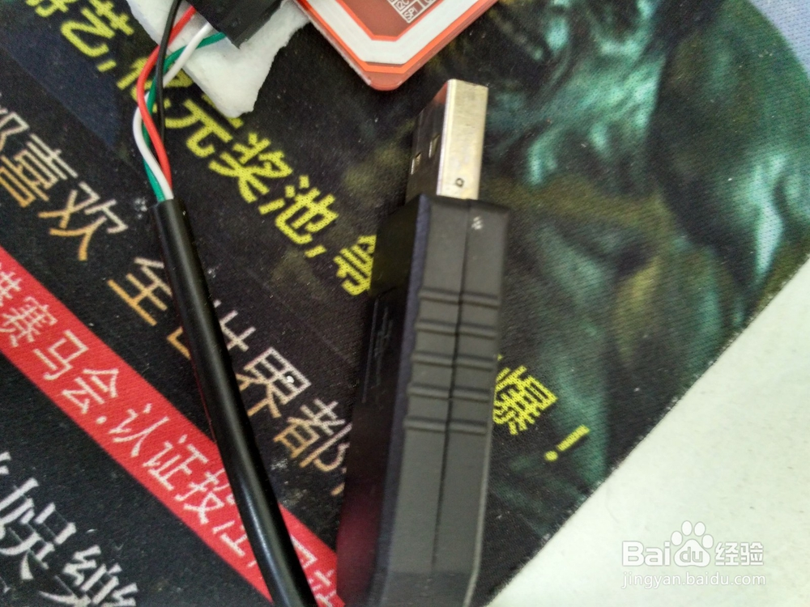
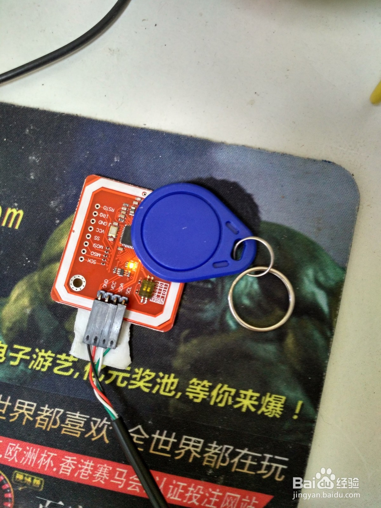
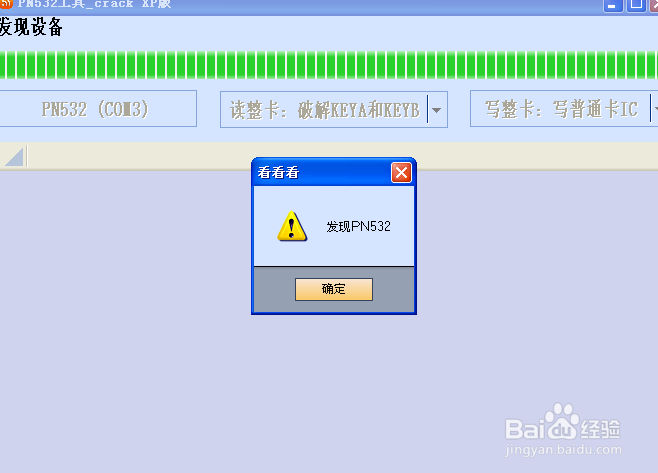
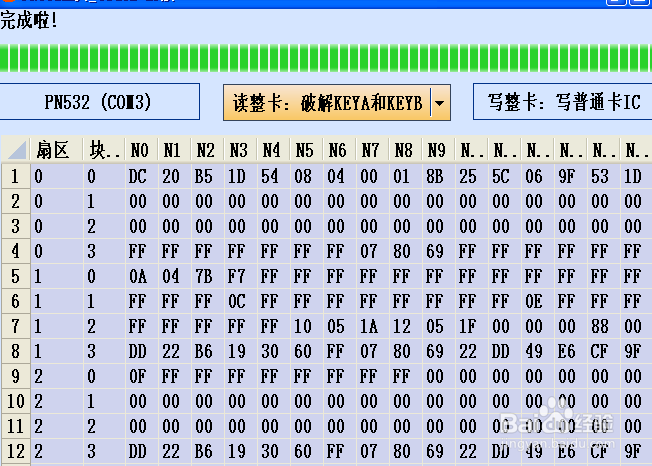
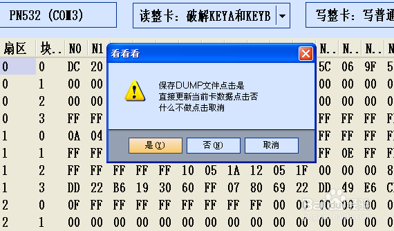
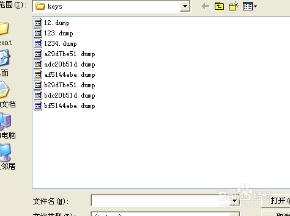

pn532
==========

pn532 破解复制IC电梯门禁卡
--------------------------

`网上地址 <https://jingyan.baidu.com/article/63f236284be1290208ab3de1.html>`_
pn532是NXP最近推出的一款NFC芯片，是一种门禁电梯等IC卡读卡器，
可以读写NFC卡片，比起PM3，arc122等读卡器便宜的多而且很好用，
【只可用于复制自己的电梯门禁卡，不得用于破解别人的切记】。
卡片可以通过usb转串口线和电脑连接进行操作过程简单方便

工具/原料
^^^^^^^^^^^
* pn532卡片一个
* usb转串口线一根

方法/步骤
^^^^^^^^^^

#. 首先要把串口线和pn532连接，方法是黑色线接GND，红色线一般是电源线接VCC,白色线接SDA,
   绿色线接SCL线一定要结对否则会烧板子，串口线和pn532板子上一般都有标识对应接就可以了，
   如果串口线上没有标识可以咨询商家确认 

   |imgpn532| 
 
   |imgttl2usb|

   
#. 将卡片和串口线连接好后将usb口插入电脑，卡片灯亮一般是黄灯，再将UID卡片放到PN532上，
   pn532四周的白线上天线。【在此之前记得要安装好pl2302usb转串口驱动，否则不能识别卡片】
   
   |imgpn532-card|
   
#. 打开PN532相应的软件PN532工具XP版http://pan.baidu.com/s/1jI2y4f0这里有软件和驱动自己下载，
   点未发现PN532设备搜寻设备，如果连接成功会弹出发现nxp设备
   
   |imgpn532-soft1|
   
#. 现在点破解key a和key b设备开始读取ic卡片信息，如果卡片有加密会自动破解密钥，如果能破解会
   提示读取成功

   |imgpn532-soft2|
   
#. 找到左侧文字扇区点旁边的灰色三角块保存读取的dump内容，文件名可以任取，后缀是默认的dump后缀
   
   |imgpn532-soft3|

#. 现在就可以写卡里，把你原卡拿开，放上空卡，记得要先读取卡片，根据你卡片类型选择相应的选项，
   普通IC卡也就是M1卡，和uid卡，卡片读取完成就可以写卡了，最好能写0扇区的UID卡，否则写卡成功
   了也不能用，因为0扇区数据没有写入。点选写UID卡选择你之前保存的dump文件，pn532就开始写入了
   很快写入完成，拿到你家电梯上试试吧，成功！
   
   |imgpn532-soft4|
 